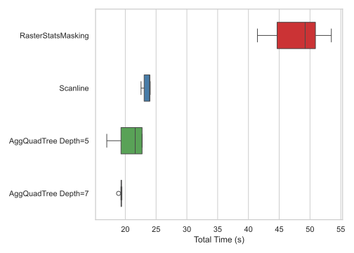
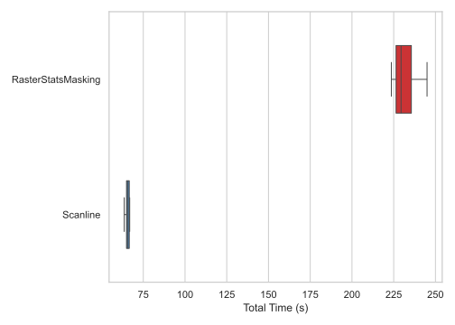

# raptor-stats

[](https://simonpedrogonzalez.github.io/raptor-stats-docs/index.html)
[](https://pypi.org/project/raptor-stats/)
[](https://github.com/simonpedrogonzalez/raptor-stats)
[](https://opensource.org/licenses/MIT)
 
#### Compute zonal statistics using efficient Raptor (Raster+Vector) methods.

## Installation

```bash
pip install raptor-stats
```

## Usage

```python
from raptorstats import zonal_stats

stats = zonal_stats("path/to/vector.shp", "path/to/raster.tif", method="scanline")
```
See the [zonal_stats API docs](https://simonpedrogonzalez.github.io/raptor-stats-docs/raptorstats.api.html#raptorstats.api.zonal_stats) for more details on input types and additional parameters.

## Methods

- `scanline`: Scans the raster file once, line by line, and computes all the intersections with the vector layer in a single pass. Suitable for fast one-time run results.
- `agqt`: Builds a QuadTree with precomputed statistics, then combines it with the scanline method to answer queries more efficiently. Suitable for systems that repeatedly query changing vector layers over the same raster.

## Performance

Raptor methods performance advantage increases with the size of the input raster and number of features. For example, with an ~1.9 billion pixel raster and 50 features (US states):



For the same raster, on but around 3000 features (US counties):




NOTES:
- These tests were made on a i7-8750H (2019) 16GB RAM Linux machine.
- The performance of the agqt method depends on the depth of the tree selected and the size of the features.

## Credits

- Author: [Simon Pedro Gonzalez](https://simonpedrogonzalez.github.io/).
- This package is based on the following <a href="assets/mdml_final_report.pdf" download>project</a>, where you can read more about the zonal stats problem, methods and performance comparison.
- This package API is inspired in the [rasterstats](https://github.com/perrygeo/python-rasterstats) package by [Matthew Perry](https://github.com/perrygeo).
